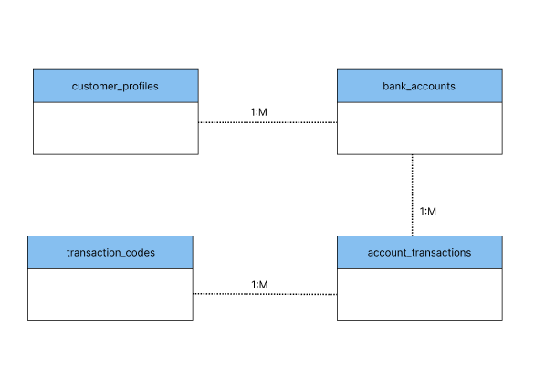
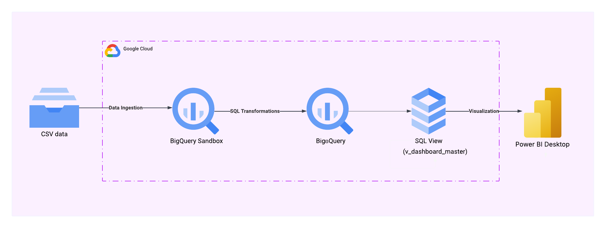
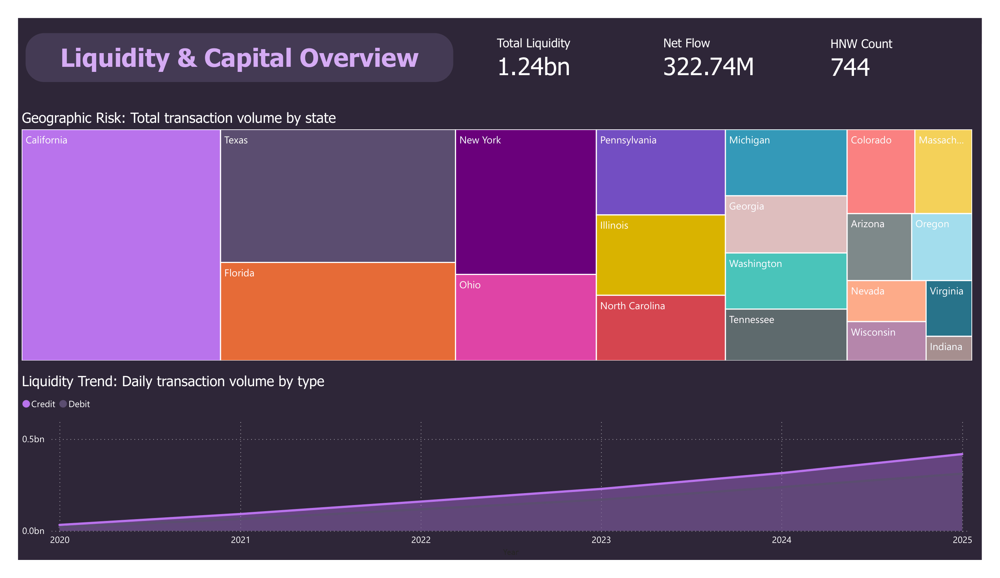

# Liquidity & Capital Analysis using BigQyery and Power BI
Built an ELT pipeline in BigQuery and created a Power BI dashboard for liquidity and capital analysis.

## Dataset
Source: [Retail Banking Dataset (2020-2025)](https://www.kaggle.com/datasets/subhanu/retail-banking-dataset)
| Table | Description | Rows|
|-------|-------------|-----:|
| customer_profiles | Customer demographics | 1,000 |
| bank_accounts | Savings, Loan, and Fixed Deposit accounts and their latest status | 3,553 |
| account_transactions | Full transaction history relating to all accounts | 2,377,169 |
| transaction_codes | Defines transaction codes used in account_transactions | 15 |

## Data Model

## Tech Stack
- Google Cloud Platform
- BigQuery
- Power BI
- SQL
- PowerShell

## Architecture

- Extracted and loaded raw CSV files into BigQuery Sandbox using PowerShell scripts.
- Handled missing values and ensured data quality through SQL transformations within the data warehouse.
- Created SQL views to provide clean, analytics-ready datasets.
- Built an interactive Power BI dashboard to support liquidity and capital analysis.

## Power BI Dashboard

## Project Structure
📁 `retail_banking/`
- 📁 `assets`/ → Image
- 📁 `power_BI`/ → Final Dashboard
- 📁 `sql`/ → SQL scripts
- load_to_bq.ps1 → PowerShell script
- README.md
